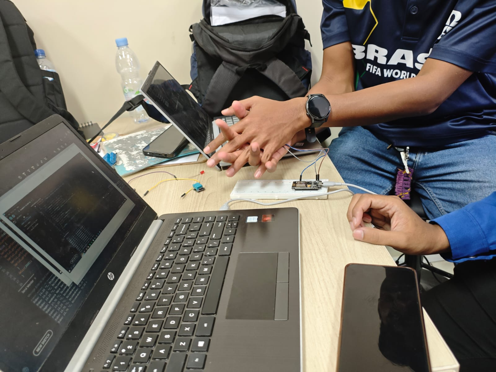

# Skematik/diagram rangkaian


# Library atau dependencies yang diperlukan
- Arduino IDE
- Library DHT sensor library
- NodeMCU ESP8266
- Sensor DHT11
- Relay atau LED

# Penjelasan kode
## kode percobaan 1A
Sensor dihubungkan dengan pin 4 atau d2 di esp8266 lalu menggunakan serial
monitor dengan baut rate 115200, pada bagian fungsi looping nya sensor akan
membaca suhu dan kelmbapan dengan jeda selama 2 detik dan akan berulang secara
terus menerus.
## kode percobaan 2A
Untuk inisiasi pin dan serial monitor sama dengan percobaan pertama namun
ditambah relay dengan pin 13 lalu dii inisiasi mati terlebih dahulu di awal . terdapat
juga threshold untuk relay sebesar 30 derajat ini digunakan sebagai batas untuk
relaynya. Kemudian di funsi loop atau utamanya sama seperti percobaan pertama
namun ditambah kondisi relay, jika suhu diatas 30 derajat maka relay akan on dan jika
dibawahnya relay akan of dan disini relay berfingsi seperti saklar.

# Penjelasan setiap fungsi
- dht.begin(): Berfungsi untuk menginisialisasi komunikasi antara mikrokontroler ESP32 dengan sensor DHT.
- dht.readTemperature(): Fungsi ini digunakan untuk membaca nilai suhu dari sensor dalam satuan derajat Celsius.
- dht.readHumidity(): Fungsi ini digunakan untuk membaca nilai kelembaban relatif udara dari sensor dalam satuan persen (%).
- isnan(nilai): Berfungsi untuk memeriksa apakah hasil pembacaan dari sensor bernilai valid atau tidak (NaN / Not a Number).
- Serial.begin(115200): Digunakan untuk memulai komunikasi serial antara ESP32 dan komputer dengan baud rate 115200 agar data dapat ditampilkan pada Serial Monitor.
- Serial.print() / Serial.println(): Menampilkan teks atau nilai variabel hasil pembacaan sensor ke Serial Monitor.
- pinMode(RELAYPIN, OUTPUT): Mengatur pin (dalam hal ini GPIO 26) sebagai jalur output atau keluaran untuk mengirimkan sinyal ke aktuator.
- digitalWrite(RELAYPIN, HIGH/LOW): Mengirimkan sinyal digital (HIGH/LOW) ke pin relay untuk mengaktifkan atau mematikan aktuator (relay/LED).
- delay(2000): Memberikan jeda waktu penundaan sebesar 2000 milidetik (2 detik) pada setiap siklus pembacaan data.

# Penjelasan percabangan/conditional

Terdapat dua bentuk percabangan utama dalam modul tersebut:
- Deteksi Error Sensor (if (isnan(kelembaban) || isnan(suhu))): Percabangan ini bertugas sebagai sistem validasi keamanan. Jika proses pengambilan data kelembaban ATAU suhu menghasilkan nilai yang tidak valid (NaN), program akan mengeksekusi blok kode untuk menampilkan peringatan "Gagal membaca data dari sensor DHT22!". Apabila data valid, program masuk ke blok else untuk mencetak nilai ke layar.
- Logika Kendali Aktuator (if (suhu > suhuThreshold)): Percabangan ini merupakan otak dari otomatisasi pada Percobaan 2A. Sistem membandingkan nilai suhu aktual yang dibaca dengan nilai ambang batas konstan yang telah ditetapkan (30.0 °C). Jika suhu lebih tinggi dari ambang batas, blok kode akan menyalakan aktuator dengan mengirimkan sinyal HIGH (digitalWrite(RELAYPIN, HIGH)). Jika kondisi tersebut tidak terpenuhi (suhu di bawah atau sama dengan threshold), maka blok else dijalankan untuk mematikan aktuator (LOW).

# Penjelasan singkat mengenai detail percobaan

## Percobaan 1A (Akuisisi Data): 
Praktikan menggunakan ESP32 untuk mengambil data kondisi lingkungan (suhu dan kelembaban) secara fisik melalui sensor digital DHT22. Data tersebut kemudian ditampilkan di Serial Monitor setiap 2 detik sebagai bukti bahwa komunikasi data berjalan sukses.  
## Percobaan 2A (Kendali Aktuator): 
Melanjutkan sistem akuisisi sebelumnya dengan menambahkan elemen output fisik berupa relay (atau simulasi LED). Mikrokontroler akan bertindak sebagai pengambil keputusan otomatis; apabila suhu lingkungan melampaui batas (30°C), mikrokontroler akan mengaktifkan relay, dan akan mematikannya kembali bila suhu turun.  

# Jawaban pertanyaan praktikum yang berkaitan dengan code
## A. A. Pertanyaan 1.5.4 No 4
```cpp
#include <DHT.h>
#define DHTPIN 4
#define DHTTYPE DHT22

DHT dht(DHTPIN, DHTTYPE);

void setup() {
  Serial.begin(115200);
  dht.begin();
  Serial.println("Memulai akuisisi data DHT22 (Rata-rata 5x)...");
}

void loop() {
  float totalSuhu = 0;
  float totalKelembaban = 0;
  int jumlahValid = 0;

  // Melakukan 5 kali perulangan untuk mengambil sampel data
  for (int i = 0; i < 5; i++) {
    float h = dht.readHumidity();
    float t = dht.readTemperature();

    // Pastikan data valid sebelum dimasukkan ke perhitungan total
    if (!isnan(h) && !isnan(t)) {
      totalSuhu += t;
      totalKelembaban += h;
      jumlahValid++;
    }
    delay(2000); // Harus ada jeda 2 detik antar pembacaan sesuai datasheet DHT22
  }

  // Jika minimal ada 1 data valid yang berhasil dibaca dari 5 percobaan
  if (jumlahValid > 0) {
    float rataSuhu = totalSuhu / jumlahValid;
    float rataKelembaban = totalKelembaban / jumlahValid;

    Serial.print("Rata-rata Suhu: ");
    Serial.print(rataSuhu);
    Serial.print(" °C, Rata-rata Kelembaban: ");
    Serial.print(rataKelembaban);
    Serial.println("%");
  } else {
    Serial.println("Gagal membaca data dari sensor DHT22 sama sekali!");
  }
}
```

- `float totalSuhu = 0;` dan `float totalKelembaban = 0;`: Variabel lokal di dalam fungsi loop yang digunakan untuk mengakumulasi total nilai suhu dan kelembaban pada setiap siklus.
- `int jumlahValid = 0;`: Variabel penghitung berapa kali sensor berhasil membaca data yang valid (bukan NaN).
- `for (int i = 0; i < 5; i++) { ... }`: Struktur perulangan (loop) yang memaksa ESP32 untuk melakukan pembacaan sebanyak 5 kali berturut-turut.
- `if (!isnan(h) && !isnan(t))`: Validasi yang mengecek apakah data valid. Jika bernilai valid (`!isnan`), nilai suhu dan kelembaban ditambahkan ke variabel `totalSuhu` dan `totalKelembaban`, serta `jumlahValid` bertambah (increment).
- `delay(2000);`: Ditempatkan di dalam perulangan `for` karena sensor DHT22 secara perangkat keras membutuhkan waktu jeda minimal sekitar 2 detik antar pengambilan sampel.
- `float rataSuhu = totalSuhu / jumlahValid;`: Perhitungan rata-rata aktual dengan membagi total data dengan jumlah pembacaan yang sukses (mencegah *error divide by zero* jika ada data NaN di tengah-tengah iterasi).

## Pertanyaan 1.6.4 No 4
```cpp
#include <DHT.h>
#define DHTPIN 4
#define DHTTYPE DHT22
#define RELAYPIN 26

DHT dht(DHTPIN, DHTTYPE);

// Mendefinisikan dua ambang batas (Histerisis)
const float suhuBatasAtas = 30.0;
const float suhuBatasBawah = 28.0;

void setup() {
  Serial.begin(115200);
  dht.begin();
  pinMode(RELAYPIN, OUTPUT);
  digitalWrite(RELAYPIN, LOW); // Aktuator mati di awal
}

void loop() {
  float suhu = dht.readTemperature();

  if (isnan(suhu)) {
    Serial.println("Gagal membaca data sensor!");
  } else {
    Serial.print("Suhu: ");
    Serial.print(suhu);
    Serial.print(" °C -> ");

    // Kendali Histerisis
    if (suhu > suhuBatasAtas) {
      digitalWrite(RELAYPIN, HIGH);
      Serial.println("Aktuator: ON (Melebihi batas atas)");
    } else if (suhu < suhuBatasBawah) {
      digitalWrite(RELAYPIN, LOW);
      Serial.println("Aktuator: OFF (Di bawah batas bawah)");
    } else {
      // Jika suhu di antara 28.0 dan 30.0, biarkan status aktuator tidak berubah
      Serial.println("Aktuator: [Status Tertahan - Area Histerisis]");
    }
  }
  delay(2000);
}
```
- `const float suhuBatasAtas = 30.0;`: Variabel konstanta untuk mendefinisikan batas suhu tinggi saat aktuator (misal kipas) harus aktif.
- `const float suhuBatasBawah = 28.0;`: Variabel konstanta baru yang mendefinisikan batas suhu rendah saat aktuator boleh dimatikan.
- `if (suhu > suhuBatasAtas)`: Kondisi pertama. Jika suhu melampaui batas atas (>30), maka relay dihidupkan (HIGH).
- `else if (suhu < suhuBatasBawah)`: Kondisi kedua. Hanya jika suhu benar-benar turun ke bawah batas bawah (<28), maka relay diputus (LOW).
- `else`: Kondisi rentang suhu di antara 28.0°C hingga 30.0°C (deadband). Dalam blok ini, tidak ada pemanggilan `digitalWrite()`, yang berarti pin relay akan mempertahankan instruksi terakhir/sebelumnya tanpa berubah statusnya.


# dokumentasi



