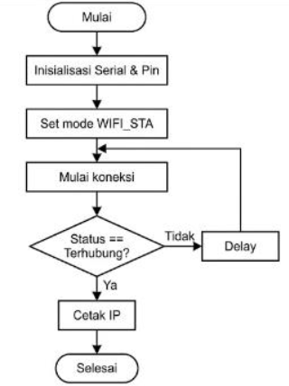

# Skematik/diagram rangkaian


# Library atau dependencies yang diperlukan
- Arduino IDE
- Library ESP8266 wifi 
- NodeMCU ESP8266
- Relay atau LED
- kanel jumper 
- resistor
- breadboard

# Penjelasan kode
## kode percobaan 1A
Program ini mengatur ESP32 sebagai klien WiFi menggunakan WiFi.mode(WIFI_STA).
Proses koneksi ke router diinisialisasi melalui WiFi.begin(ssid, password) dan ditunggu
menggunakan perulangan while hingga statusnya WL_CONNECTED. Setelah berhasil
terhubung, program mengambil dan menampilkan data jaringan seperti alamat IP, MAC
Address, dan RSSI (kekuatan sinyal).

## kode percobaan 2A
Program ini menjadikan ESP32 sebagai pemancar WiFi (hotspot) dengan perintah
WiFi.mode(WIFI_AP). Jaringan SSID dan password mandiri dibuat menggunakan
WiFi.softAP(ap_ssid, ap_password). Alamat IP jaringan lokal ditampilkan dengan
WiFi.softAPIP() (default 192.168.4.1). Pada perulangan utama, program secara aktif
menghitung dan menampilkan jumlah perangkat (klien) yang terhubung ke ESP32
tersebut.

# Penjelasan setiap fungsi
- `WiFi.mode()`: Menetapkan mode operasi jaringan pada ESP32, seperti mode Station (STA), Access Point (AP), atau gabungan keduanya (AP+STA).  
- `WiFi.begin(ssid, password)`: Memulai proses koneksi ESP32 ke jaringan Wi-Fi eksternal pada mode Station.  
- `WiFi.status()`: Mengembalikan nilai status koneksi saat ini, seperti WL_CONNECTED jika koneksi sukses.  
- `WiFi.localIP()`: Menampilkan alamat IP yang diterima oleh ESP32 dari router pada mode Station.  
- `WiFi.macAddress()`: Menampilkan alamat MAC dari perangkat ESP32.  
- `WiFi.RSSI()`: Menunjukkan kekuatan sinyal jaringan Wi-Fi dalam satuan dBm.  
- `WiFi.softAP(ssid, password)`: Mengaktifkan mode Access Point mandiri pada ESP32 dengan SSID dan kata sandi yang telah ditentukan.  
- `WiFi.softAPIP()`: Menampilkan alamat IP default dari Access Point yang dipancarkan oleh ESP32.  
- `WiFi.softAPgetStationNum()`: Menghitung dan mengembalikan jumlah perangkat klien yang sedang terhubung ke Access Point ESP32.

# Penjelasan percabangan/conditional
perulangan:
`while (WiFi.status() != WL_CONNECTED)`: Loop ini berfungsi untuk menahan eksekusi program. Selama ESP32 belum terhubung ke WiFi, program akan terus mencetak titik (.) di Serial Monitor sambil menunggu koneksi stabil.  

percabagan
`if (WiFi.status() == WL_CONNECTED) ... else ...`: Blok percabangan ini digunakan di dalam fungsi `loop()` untuk memantau status jaringan setiap 5 detik. Jika ESP32 masih tersambung, program akan mencetak "Status: Terhubung". Jika koneksi putus, program akan masuk ke blok else untuk mencetak "Status: Terputus" dan mematikan LED.  


# Penjelasan singkat mengenai detail percobaan
### Percobaan 2A (Mode Station)
Mengonfigurasi ESP32 untuk bertindak sebagai klien (seperti laptop/smartphone) yang menyambung ke jaringan WiFi yang sudah ada. Tujuannya agar ESP32 mendapat akses jaringan lokal atau internet untuk membaca IP Address, MAC, dan kekuatan sinyal.  
### Percobaan 2B (Mode Access Point)
Mengonfigurasi ESP32 menjadi penyedia jaringan (hotspot) mandiri. Perangkat ini membuat jaringan baru agar smartphone atau laptop lain dapat langsung terhubung kepadanya tanpa memerlukan router tambahan.

# Jawaban pertanyaan praktikum yang berkaitan dengan code
## Pertanyaan 2.5.4 No 4
```cpp
#include <ESP8266WiFi.h>

const char* ssid = "iQOO Z9x 5G";
const char* password = "yttaajaa";

const int ledPin = 2; // LED indikator status koneksi

void setup() {
  Serial.begin(115200);
  pinMode(ledPin, OUTPUT);
  digitalWrite(ledPin, LOW);

  // Set mode WiFi menjadi Station
  WiFi.mode(WIFI_STA);
  WiFi.begin(ssid, password);

  Serial.print("Menghubungkan ke WiFi");
  // Loop hingga status WiFi terkoneksi (perbaikan operator !=)
  while (WiFi.status() != WL_CONNECTED) {
    delay(500);
    Serial.print(".");
  }

  // Jika berhasil terhubung
  Serial.println();
  Serial.println("WiFi berhasil terhubung!");
  Serial.print("IP Address : ");
  Serial.println(WiFi.localIP());
  Serial.print("MAC Address: ");
  Serial.println(WiFi.macAddress());
  Serial.print("RSSI (dBm) : ");
  Serial.println(WiFi.RSSI());
  digitalWrite(ledPin, HIGH); // nyalakan LED sebagai indikator
}

void loop() {
  // Cek status koneksi setiap 5 detik
  if (WiFi.status() == WL_CONNECTED) {
    Serial.println("Status: Terhubung");
  } else {
    Serial.println("Status: Terputus");
    digitalWrite(ledPin, LOW);

    WiFi.disconnect();//modifikasi pada bagian ini
    WiFi.reconnect();//
  }
  delay(5000);
}
```

- `WiFi.disconnect();` : Memastikan koneksi yang bermasalah diputus sepenuhnya sebelum mencoba koneksi baru.
- `WiFi.reconnect();` : Memerintahkan ESP32 untuk secara otomatis mencoba menyambung kembali ke jaringan WiFi menggunakan SSID dan password yang sebelumnya sudah dimasukkan pada `WiFi.begin()`.

## Pertanyaan 2.6.4 No 4
```cpp
#include <ESP8266WiFi.h>

const char* sta_ssid = "hammed";
const char* sta_password = "kudalari";

const char* ap_ssid = "ESP32_AccessPoint";
const char* ap_password = "12345678"; // minimal 8 karakter

void setup() {
  Serial.begin(115200);
  pinMode(ledPin, OUTPUT);
  digitalWrite(ledPin, LOW);

  // Set mode WiFi menjadi Access Point
  WiFi.mode(WIFI_AP_STA);
  Serial.println("Mengaktifkan mode AP+STA...");

  WiFi.softAP(ap_ssid, ap_password);
  Serial.print("AP Lokal aktif. SSID: ");
  Serial.print(ap_ssid);
  Serial.print(", IP: ");
  Serial.println(WiFi.softAPIP());

  // Mulai koneksi mode STA (Klien Internet)
  Serial.print("Mencoba menghubungkan STA ke Internet via: ");
  Serial.println(sta_ssid);
  WiFi.begin(sta_ssid, sta_password);

  // Loop waiting untuk koneksi STA ke router Internet
  while (WiFi.status() != WL_CONNECTED) {
    delay(500);
    Serial.print(".");
  }

  // Jika berhasil terhubung STA
  Serial.println("");
  Serial.println("STA berhasil terhubung ke Router Internet!");
  Serial.print("IP STA (dari Router): ");
  Serial.println(WiFi.localIP());
  
  // Nyalakan LED indikator koneksi STA sukses
  digitalWrite(ledPin, HIGH);
}

void loop() {
  // Menampilkan jumlah perangkat yang terhubung setiap 5 detik
  // (perbaikan penambahan operator =)
  int jumlahClient = WiFi.softAPgetStationNum(); 
  
  Serial.print("Jumlah perangkat terhubung: ");
  Serial.println(jumlahClient);
  delay(5000);
}
```
- `WiFi.mode(WIFI_AP_STA);` : Mengubah mode WiFi menjadi mode gabungan, sehingga fungsi Access Point dan Station dapat berjalan bersamaan.
- `WiFi.begin(ssid, password);` : Memulai koneksi ESP32 ke jaringan WiFi eksternal (router/hotspot) sebagai Station.
- `WiFi.softAP(ap_ssid, ap_password);` : Mengaktifkan ESP32 sebagai Access Point dengan SSID dan password khusus agar perangkat lain dapat terhubung ke ESP.

# dokumentasi


    